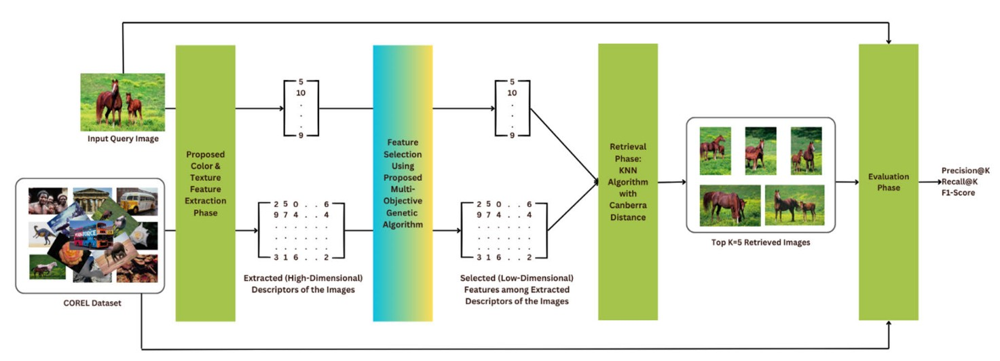

# Seleção de Características Baseada em Algoritmos Genéticos a partir de Descritores de Alta Dimensionalidade para a Melhoria da Recuperação de Imagens Baseada em Conteúdo
**Grupo:** Eduarda Lopes, Carla Azevedo, Lucas Matos

---

## Resumo do Enunciado do Trabalho
Reproduzir e analisar experimentos de um artigo que utilize algoritmos genéticos em problemas reais, utilizando o mesmo dataset/benchmark ou parte dele.
Extrair arquitetura, parâmetros e métricas do artigo, testar variações justificadas para melhorar resultados, e comparar com o baseline.
Apresentar objetivo, relevância, metodologia, resultados, comparação com o artigo, conclusões e código.

---

## Artigo
**Título:** Genetic Algorithm-Based Feature Selection From High-Dimensional Descriptors for Improved Content-Based Image Retrieval
**Autores:** Amirhossein Roodaki, Mahmood Sotoodeh, Mohammad Reza Moosavi
**Publicação:** IEEE Access, vol. 13, pp. 198034-198053, 2025, doi: 10.1109/ACCESS.2025.3633906
[Link para o artigo](https://ieeexplore.ieee.org/document/11251209)

---

## Análise Inicial do Artigo
O artigo identifica e mitiga um problema clássico de sistemas de recuperação de imagens baseadas em conteúdo: a alta dimensionalidade do conjunto de features extraídas das imagens. Os autores propuseram um algoritmo genético que visa otimizar a seleção de features para recuperação de imagens, buscando aumentar tanto a acurácia quanto a eficiência computacional. O método atua de forma complementar aos tradicionais de deep learning, podendo operar tanto em features handmade quanto profundas. Assim, esse modelo otimizado consegue compactar features altamente discriminantes, alcançando performances comparativas ou competitivas com abordagens tradicionais e baseadas em deep learning, porém com menor dimensionalidade.

Esse avanço é possível por causa da função de fitness do AG, que equilibra explicitamente dois objetivos: maximizar a precisão de recuperação e minimizar o número de features selecionadas. Dessa forma, o algoritmo explora o espaço de possíveis combinações de features para identificar um subconjunto quase ótimo que apresenta um bom equilíbrio entre performance e eficiência. O método se destaca por produzir um conjunto de features mais compacto e discriminativo, podendo alcançar desempenho competitivo em relação a pipelines baseados puramente em deep learning, especialmente quando o custo computacional é relevante. Além disso, os novos descritores de cor introduzidos pelo artigo, no caso os histogramas de cores de alta dimensionalidade 2D e método Complete Local Binary Patterns para textura, mostraram vantagem quantitativa clara em relação aos tradicionais. Um ponto forte do método é que o AG é agnóstico à origem das features, podendo ser aplicado tanto a descritores handcrafted quanto a features extraídas por redes neurais profundas.

As perspectivas futuras da pesquisa incluem a aplicação do método em datasets de imagens médicas, onde a recuperação eficiente baseada em conteúdo pode auxiliar diagnósticos mais rápidos e precisos. Outra linha futura é adaptar o AG para realizar ponderação de features, em vez de apenas seleção binária, além da exploração de abordagens híbridas, como a combinação de algoritmos genéticos com reinforcement learning, para tornar o processo de otimização ainda mais adaptativo.

Os autores escolheram o AG como método de otimização por alguns motivos. O primeiro é que as possíveis combinações de features, que configuram o espaço de busca do algoritmo, formam um espaço combinatorial de alta dimensionalidade, e isso o AG consegue contornar por explorar o espaço de forma heurística. Por se tratar de uma otimização multiobjetivo (maximizar precisão e minimizar dimensionalidade), o AG é um método favorável também, pois permite incorporar esse equilíbrio diretamente na função de fitness por meio de ponderações. Por fim, a não linearidade do problema é um atrativo ao AG, já que ele não depende de gradiente. Comparando trabalhos passados, os autores perceberam que o diferencial do uso do AG está em atuar explicitamente como um método de seleção de features que pondera o trade-off entre precisão e dimensionalidade. Enquanto isso, abordagens anteriores aumentam a precisão à custa de vetores de características cada vez maiores ou utilizam técnicas de redução de dimensionalidade que não consideram diretamente o desempenho de recuperação como critério principal.

---

## Dados e Geração
As imagens são analisadas e, a partir delas, são extraídos descritores visuais, resultando em vetores numéricos de características - features. Os tipos de features utilizadas incluem histogramas de cor nos espaços RGB, HSV e LAB, histogramas de cor 2D de alta dimensionalidade e o descritor de textura CLBP (Complete Local Binary Patterns). A concatenação desses descritores forma um vetor de alta dimensão que representa cada imagem. A database possuirá um descritor multi-dimensional, enquanto a imagem da query terá um descritor unidimensional. A partir desses vetores da database, o AG atua selecionando um subconjunto ótimo de features da database, reduzindo a dimensionalidade enquanto busca manter ou melhorar o desempenho de recuperação das imagens. Assim, a feature da query será comparada com o subconjunto de features otimizado pelo AG pelo KNN usando distância Canberra, gerando um top-k imagens recuperadas que deverão ser semelhantes a da query.



### Extração de Features
Para descrever as características de uma imagem, esse artigo usa cores e textura como features de uma imagem. As features de cores capturam a distribuição das cores, enquanto as features de textura capturam detalhes estruturais e padrões. A combinação dessas duas features garantem robustez e confiabilidade na recuperação de imagens baseada em conteúdo.

#### Cores
Para as cores, usaremos features de cor baseadas em histogramas, que são descritores globais amplamente conhecidos conforme os autores afirmam. Faremos então, conforme o método original dos autores, a geração de um conjunto de novos descritores de histogramas de cor 2D.

Há diferentes espaços de cor: RGB (red, blue, green), HSV (matiz, saturação, valor), LAB (lightness, A*, B*). Para capturar a distribuição de cores de uma imagem, calcula-se um histograma 1D para cada canal de cor RGB, HSV e LAB. Ele representa a frequência dos valores de intensidade dos pixels dentro de um canal - é uma representação das características de cor de uma imagem.

Contudo, os histogramas 1D não consideram como os canais de cada cor interagem entre si. Assim, os autores introduziram um histograma de cor 2D contornando essa limitação, sendo uma descritor estatístico simples registrando a frequência conjunta de pares de intensidades de pixels de dois canais, seja dentro do mesmo espaço de cor (intra-espaço) ou entre diferentes espaços de cor (inter-espaço). Esses histogramas são representados em forma de heatmap mostrando a intensidade do relacionamento entre canais de cada cor. A análise dessas interações entre espaços diferentes fornece insights sobre como brilho e vivacidade interagem, contribuindo para uma recuperação de imagens mais precisa.

#### Texturas
As features de textura descrevem padrões de textura mais detalhados, que servem para por exemplo distinguir regiões com cores semelhantes e padrões estruturais diferentes. Para isso, os autores usaram um descritor de textura avançado chamado Complete Local Binary Patterns (CLBP), que aprimora o Local Binary Patterns (LBP) tradicional ao incorporar tanto o sinal quanto a magnitude das diferenças de intensidade. Assim, o CLBP representa cada pixel examinando suas relações de intensidade com pixels vizinhos, gerando uma descrição de textura robusta detalhada. O descritor possui três componentes que em conjunto fornecem essa representação das características de textura local.

Então, isso é agregado em um histograma, que resume a distribuição dos padrões ao longo da imagem. O número total de features geradas por esse método é determinado pela quantidade de padrões em cada componente. 

Ao integrar o CLBP ao conjunto de features, captura-se detalhes texturais que aumentam a capacidade do sistema de diferenciar imagens com base em padrões estruturais. Essa combinação de features de textura e cor garante uma representação abrangente do conteúdo da imagem, melhorando significativamente a precisão da recuperação.

### Dataset
O artigo utiliza alguns datasets de imagens públicos, disponíveis no Kaggle para download. São eles: Corel-1K, Corel-10K, GHIM-10K, Produce-1400 e Olivia-2688. 

| Dataset | Images | Classes | Description | Download |
| :--- | :--- | :--- | :--- | :--- |
| **Corel-1K** | 1,000 | 10 | Classical benchmark (Horses, Beaches, etc.) | [Kaggle Link](https://www.kaggle.com/datasets/amirhosseinroodaki/corel-1k-corel-5k-and-corel-10k-datasets) |
| **Corel-10K** | 10,000 | 100 | Large-scale version with diverse categories | [Kaggle Link](https://www.kaggle.com/datasets/amirhosseinroodaki/corel-1k-corel-5k-and-corel-10k-datasets) |
| **GHIM-10K** | 10,000 | 20 | Geological and Heritage images | [Kaggle Link](https://www.kaggle.com/datasets/guohey/ghim10k) |
| **Produce-1400** | 1,400 | 14 | Fruits and vegetables (Object recognition) | [Kaggle Link](https://www.kaggle.com/datasets/amirhosseinroodaki/produce-1400) |
| **Olivia-2688** | 2,688 | 8 | Complex natural scenes (Nature, Street, etc.) | [Kaggle Link](https://www.kaggle.com/datasets/amirhosseinroodaki/olivia-2688) |

São a partir dessas imagens que as features são extraídas, e o AG é testado em diversos cenários utilizando a diversidade de datasets. A implementação dessa parte não será detalhada no README, pois esse não é o objetivo do nosso trabalho, mas o código estará disponível na pasta src/process_images.py. Imagem = [feature_1, feature_2, ..., feature_N]. Ou seja, cada imagem possui várias features que a descrevem, que vieram dos histogramas 1D, 2D e CLBP.

---
## Algoritmo Genético
O AG é projetado para otimizar a seleção de features, para que a acurácia e a eficiência computacional sejam melhoradas em comparação a outros métodos, visando a escalabilidade e precisão do sistema de recuperação. O método de AG proposto pelos autores considera dois objetivos conflitantes: maximizar a acurácia de recuperação (features selecionadas devem contribuir significativamente para o processo de correspondência de imagens) e minimizar o número de features (reduzir a dimensionalidade para boa eficiência computacional). O AG decide qual das N features de uma imagem devem ser usadas de forma subótima. 

Modelagem do problema: 
- Solução do problema: subconjunto ótimo de features (características) das imagens que maximize a precisão da recuperação e minimize a quantidade de features usadas.
- Indivíduo: subconjunto de features definido por uma máscara binária aplicada ao vetor de características de todas as imagens do sistema (query e banco de dados). A representação é binária: 1 = feature usada no vetor de representação da imagem, 0 = feature excluída do processo de similaridade. Há a seleção somente das features que foram incluídas, o que reduz a dimensionalidade do vetor de características. Sua representação é:
    - ```python
      Vetor original: [f1, f2, f3, f4, f5, f6, f7, f8]
      Indivíduo:      [1, 0, 1, 0, 0, 1, 0, 1]
      Resultado:      [f1,    f3,        f6,    f8]
      ```
    - Uma outra representação possível poderia ser uma lista de índices das features selecionadas. Essa representação teria desvantagens como crossover dificultado e mutação com risco de duplicatas. A versão binária é melhor por facilitar operadores genéticos.
- Função objetivo: $\text{Fitness}(Ind) = \alpha \cdot \text{Precision}(Ind) + (\alpha - 1) \cdot \frac{F_{\text{selected}}}{F_{\text{total}}}$
- Operadores genéticos: seleção por torneio, cruzamento uniforme, mutação bit-flip. 
- Restrições: pelo menos uma feature deve ser selecionada, e a precisão deve estar entre 0 e 1. 
- Não é necessário corrigir indivíduos porque todo cromossomo binário já é válido por definição. Cada indivíduo representa apenas a seleção ou não de features, não havendo restrições rígidas de cardinalidade ou domínio que exijam reparo. Os indivíduos ruins serão penalizados implicitamente na função fitness, equilibrando precisão e compactação do vetor de características. O próprio processo evolutivo tende a descartar soluções inadequadas.

Para cada indivíduo do AG, o sistema extrai os vetores completos da minha imagem query e o vetor completo de todas as imagens do banco, aplica a máscara do indivíduo, calcula a similaridade, gera top-K e mede a precisão. Seguindo o fluxo de dados considerado anteriormente, o termo query será equivalente a imagem que estou querendo achar similares e database será todo o conjunto de imagens disponíveis no banco de dados. As etapas do AG proposto são as seguintes:
1. Inicialização da população: a população inicial gerada é diversa, ou seja, inicialmente é gerada de forma aleatória. A diversidade na população garante uma exploração ampla do espaço de features, aumentando a probabilidade de encontrar soluções ótimas.
2.  A query e as imagens da database são representadas por vetores de features, e cada indivíduo define um subespaço de features selecionadas. Depois, calcula-se a distância entre a query e as imagens da database, ordena-se por similaridade e retorna as top-K imagens mais próximas. 
3. Cada indivíduo é avaliado usando a função objetivo ponderada que equilibra precisão e número de features selecionadas. Explicando cada termo da equação:
    - Precision(Ind): mede-se quantas imagens são relevantes de acordo com a query, calculada pela razão entre quantidade de imagens relevantes / quantidade de imagens retornadas. Termo de maximização do problema.
    - F_selected/F_total: mede a proporção de features selecionadas, ou seja, a razão entre o número de features mantidas pelo indivíduo (número de 1 no cromossomo) pelo total de features originalmente extraídas da imagem. Termo associado à minimização da dimensionalidade do vetor.
    - $\alpha$: é o peso da precisão, controla o quão relevante é recuperar imagens corretas em comparação a redução do número de features.
    - $\alpha - 1$: controla o peso do tamanho do vetor, ou seja, o quão relevante é reduzir o número de features em comparação a precisão. 
    - É importante ressaltar que como $\alpha$ > $\alpha - 1$, o termo da precisão tem maior peso na função. Se a precisão crescer, o fitness sobe, enquanto o termo de compactação está relacionado à proporção de features selecionadas. Então o valor de $\alpha$ define o quanto a precisão domina a equação. Ou seja, se $\alpha$ for grande, o AG pode preferir usar mais features se isso compensar no ganho de precisão.
4. Então, é feita uma seleção por Torneio. Subconjuntos da população são amostrados aleatoriamente e o indivíduo mais apto (maior fitness) em cada subconjunto é escolhido para reprodução. Isso garante que soluções de maior qualidade tenham maior probabilidade de transmitir suas características às gerações seguintes, mantendo a diversidade genética.
5. Também é adotado o Cruzamento Uniforme, em que as features de dois indivíduos pais selecionados são misturadas aleatoriamente para criação de novos descendentes. Essa operação gera indivíduos que combinam características de ambos os pais, promovendo a descoberta de novos subconjuntos de features e a exploração.
6. Para manter a diversidade e evitar convergência prematura, bits aleatórios na representação das features são invertidos (de 1 para 0 ou vice-versa). Isso ajuda o algoritmo a explorar novas combinações de features e escapar de ótimos locais.
7. A população evolui ao longo de múltiplas gerações, melhorando gradualmente os subconjuntos de features selecionados. O processo continua até que uma condição de parada seja atingida, como um número fixo de gerações ou convergência do fitness. A solução final fornece um equilíbrio ótimo entre a dimensionalidade das features e a acurácia da recuperação.

Em resumo: inicialmente, são extraídos os vetores de características de todas as imagens. Em seguida, é inicializada uma população de indivíduos, onde cada indivíduo é uma máscara binária de seleção de features. Para avaliar um indivíduo, a máscara é aplicada aos vetores da query e da base de dados, calcula-se a similaridade, recuperam-se as K imagens mais próximas e mede-se a precisão e o nível de compactação. O fitness é então calculado. Após isso, aplicam-se seleção, cruzamento e mutação para gerar a próxima população, repetindo o processo até o critério de parada.

---
## Implementação

---
## Conclusões

---
## Referências
A. Roodaki, M. Sotoodeh and M. Reza Moosavi, "Genetic Algorithm-Based Feature Selection From High-Dimensional Descriptors for Improved Content-Based Image Retrieval," in IEEE Access, vol. 13, pp. 198034-198053, 2025, doi: 10.1109/ACCESS.2025.3633906.

https://github.com/Roodaki/GA-FS-CBIR

M. Sotoodeh, M. R. Moosavi, and R. Boostani, “A novel adaptive LBP-based descriptor for color image retrieval,” Expert Syst. Appl., vol. 127, pp. 342–352, Aug. 2019.
